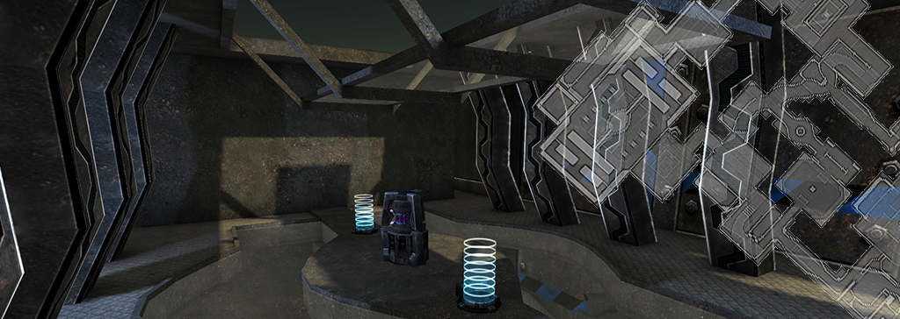
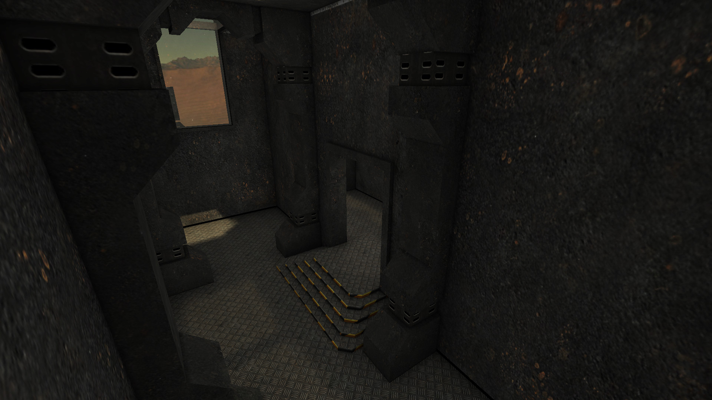
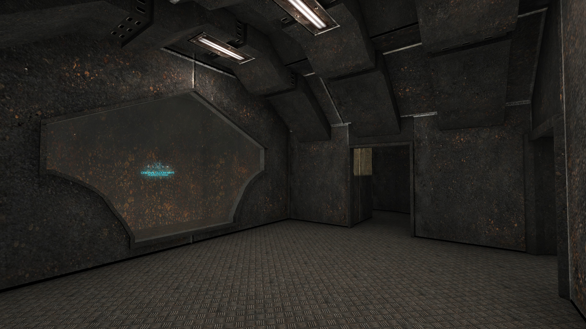
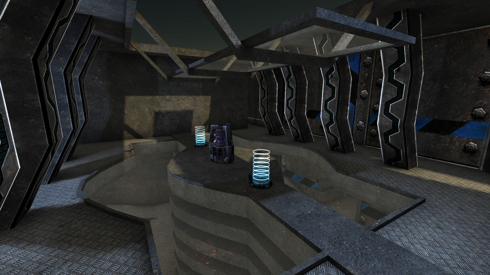
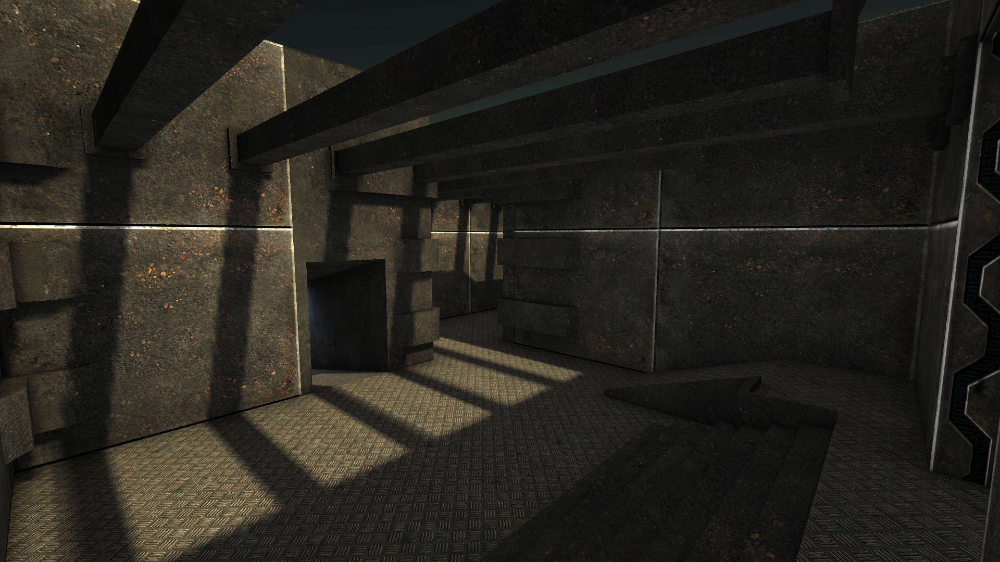
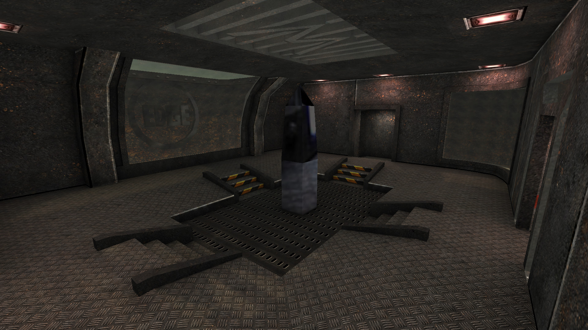
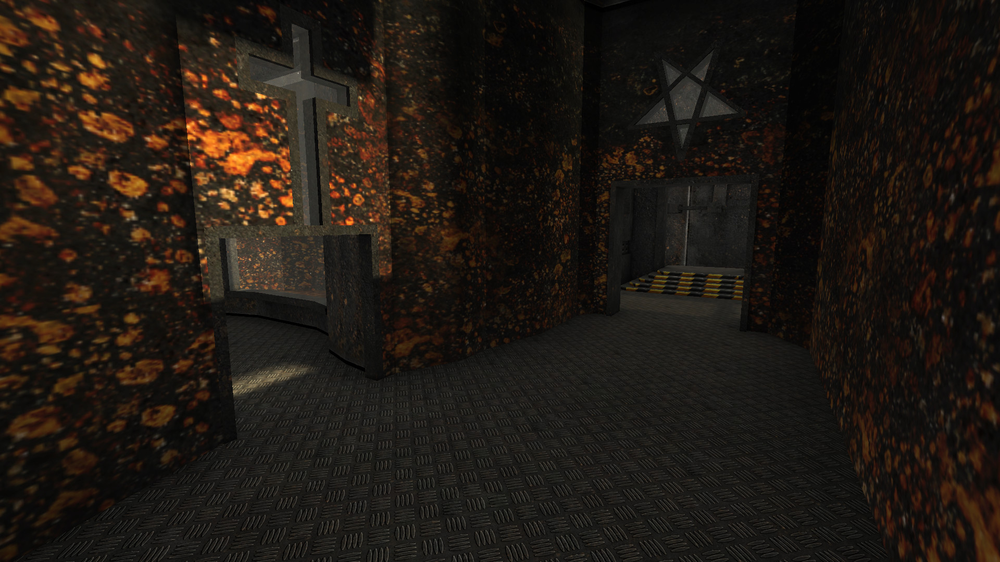
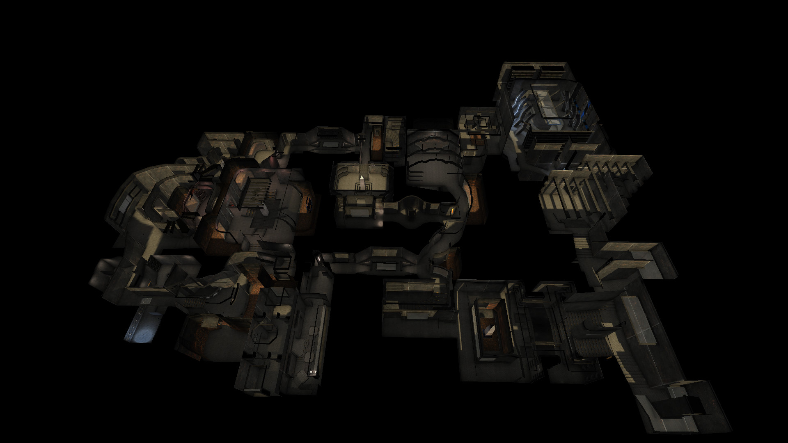

# Satan - Game Level For Tremulous
 

## Overview: Gloom Port

Satan is a game level by Matthias "Masmblr" Peters for the open source game [_Tremulous_](https://tremulous.net/).

Map Description: 
> "Satan" is a map port from Gloom Quake 2. It pays homage to the classic era of gloom gaming. Drawing inspiration from the tight, fast-paced gameplay of Quake 2, this map brings back the spirit of the past while offering a fresh experience. The entire map has been re-textured with a suite of new textures, enhancing the atmosphere. 
 
* * *

## Screenshots:
[](meta/preview_levelshots/1.jpg)
[](meta/preview_levelshots/2.jpg)
[](meta/preview_levelshots/3.jpg)
[](meta/preview_levelshots/4.jpg)
[](meta/preview_levelshots/5.jpg)
[](meta/preview_levelshots/6.jpg)
[](meta/preview_levelshots/7.jpg)
[](meta/preview_levelshots/8.jpg)

## Version History:
| Version: | Date:        | Status: |
| ------- | ------------- | ------: |
| 0.1     | 18/07/2013  | alpha |
| 1.0     | 21/08/2021  | release |

## How-To
**Binary**:
1. Download the release package.
2. Save the *.pk3 file to the following directory: `/%PATH%/Tremulous/base/`.
3. Start the Tremulous game and select "Create Server" with the desired map.

**Source**:
1. Download the [source release](https://github.com/Masmblr/map-Satan_src/releases/) and the [tremulous-common-files](https://github.com/Masmblr/tremulous-map-common/releases/tag/v1.0).
2. Extract the files to the default installation directory. It should look like this:

```
DRIVE:/%PATH%/tremulous/
|   tremulous.exe
|   tremulous.x86
|   ...
+---base
|   |   autogen.cfg
|   |   data-1.1.0.pk3
|   |   map-atcs-1.1.0.pk3
|   |   ...
|   +---env
|   +---maps 
|   +---models 
|   +---scripts
|   +---sounds
|   \---textures
```
1. Download [NetRadiant Level Editor](https://netradiant.gitlab.io/page/download/).
2. Launch NetRadiant and select "Tremulous" as your game setting.
3. Open the '.map' file located in the directory `/%PATH%/tremulous/base/maps` and, from the menu, choose 'Build -> 'Build with final settings.'
4. Start the Tremulous game with `-sv_pure 0 -devmap MAPNAME`. Make sure to replace "MAPNAME" with the actual name of the map you compiled.

## Development Tools:
Photoshop CS6 \
[Audacity](https://www.audacityteam.org/) \
[NetRadiant](https://netradiant.gitlab.io/) \
[Q3Map2](http://q3map2.robotrenegade.com/)

## Related Resources:
Official Tremulous website: https://tremulous.net </br>
NET Radiant Level-Editor: https://netradiant.gitlab.io </br>
Master-Server-List: http://dpmaster.deathmask.net/?game=tremulous </br>
Unofficial successor "Unvanquished": https://unvanquished.net

## Legal Information and Attribution
Some assets may be derivative works or subject to different licenses. Please refer for author and license details. Note that some files may have been modified. Below is a list of files and their legal statuses.

***
levelshots\satan.jpg <sup>[1](#Credit-1)</sup> \
maps\satan.map <sup>[1,2](#Credit-1)</sup> \
scripts\satan.arena <sup>[1](#Credit-1)</sup> \
scripts\satan.shader <sup>[1](#Credit-1)</sup> \
scripts\shaderlist.txt <sup>[1](#Credit-1)</sup> \
textures\satan\boden_00_fugenlos.jpg <sup>[1](#Credit-1)</sup> \
textures\satan\boden_01_fugenlos.jpg <sup>[1](#Credit-1)</sup> \
textures\satan\boden_02.jpg <sup>[1](#Credit-1)</sup> \
textures\satan\boden_03.jpg <sup>[1](#Credit-1)</sup> \
textures\satan\boden_04.jpg <sup>[1](#Credit-1)</sup> \
textures\satan\kiste_00.jpg <sup>[1](#Credit-1)</sup> \
textures\satan\kiste_01.jpg <sup>[1](#Credit-1)</sup> \
textures\satan\kiste_01b.jpg <sup>[1](#Credit-1)</sup> \
textures\satan\kiste_02.jpg <sup>[1](#Credit-1)</sup> \
textures\satan\platte_00.jpg <sup>[1](#Credit-1)</sup> \
textures\satan\platte_01.jpg <sup>[1](#Credit-1)</sup> \
textures\satan\platte_01_ks.jpg <sup>[1](#Credit-1)</sup> \
textures\satan\platte_01_steifen_b.jpg <sup>[1](#Credit-1)</sup> \
textures\satan\platte_01_steifen_r.jpg <sup>[1](#Credit-1)</sup> \
textures\satan\platte_01_steifen_w.jpg <sup>[1](#Credit-1)</sup> \
textures\satan\platte_halb_00.jpg <sup>[1](#Credit-1)</sup> \
textures\satan\platte_halb_01.jpg <sup>[1](#Credit-1)</sup> \
textures\satan\platte_halb_03.jpg <sup>[1](#Credit-1)</sup> \
textures\satan\sfx_glass_01.jpg <sup>[1](#Credit-1)</sup> \
textures\satan\sign_edge.jpg <sup>[1](#Credit-1)</sup> \
textures\satan\strebe_00_b.jpg <sup>[1](#Credit-1)</sup> \
textures\satan\strebe_00_r.jpg <sup>[1](#Credit-1)</sup> \
textures\satan\strebe_00_w.jpg <sup>[1](#Credit-1)</sup> \
textures\satan\strebe_01_gitter.jpg <sup>[1](#Credit-1)</sup> \
textures\satan\strebe_02.jpg <sup>[1](#Credit-1)</sup> \
textures\satan\stufe_00_warnanstrich.jpg <sup>[1](#Credit-1)</sup> \
textures\satan\stufe_01.jpg <sup>[1](#Credit-1)</sup> \
textures\satan\stufe_02.jpg <sup>[1](#Credit-1)</sup> \
textures\satan\stufe_03.jpg <sup>[1](#Credit-1)</sup> \
textures\satan\wand_00_rost.jpg <sup>[1](#Credit-1)</sup> \
textures\satan\wand_00_rost_b.jpg <sup>[1](#Credit-1)</sup> \
textures\satan\wand_01_fugenlos.jpg <sup>[1](#Credit-1)</sup> \
textures\satan\wand_02.jpg <sup>[1](#Credit-1)</sup> \
textures\satan\wand_03_riff.jpg <sup>[1](#Credit-1)</sup> \
textures\satan\envmap\fx_envmap_01.jpg <sup>[1](#Credit-1)</sup> \
textures\satan\envmap\fx_envmap_02.jpg <sup>[1](#Credit-1)</sup> \
textures\satan\envmap\fx_envmap_03.jpg <sup>[1](#Credit-1)</sup> \
textures\satan\light_01\light_01_base.jpg <sup>[1](#Credit-1)</sup> \
textures\satan\light_01\light_01_blue_add.jpg <sup>[1](#Credit-1)</sup> \
textures\satan\light_01\light_01_red_add.jpg <sup>[1](#Credit-1)</sup> \
textures\satan\light_01\light_01_white_add.jpg <sup>[1](#Credit-1)</sup> \
textures\satan\light_02\light_02_base.jpg <sup>[1](#Credit-1)</sup> \
textures\satan\light_02\light_02_blue_add.jpg <sup>[1](#Credit-1)</sup> \
textures\satan\light_02\light_02_red_add.jpg <sup>[1](#Credit-1)</sup> \
textures\satan\light_02\light_02_white_add.jpg <sup>[1](#Credit-1)</sup> \
textures\satan\light_03\light_03_base.jpg <sup>[1](#Credit-1)</sup> \
textures\satan\light_03\light_03_blue_add.jpg <sup>[1](#Credit-1)</sup> \
textures\satan\light_03\light_03_red_add.jpg <sup>[1](#Credit-1)</sup> \
textures\satan\light_03\light_03_white_add.jpg <sup>[1](#Credit-1)</sup>
***

### Credit-1
[Matthias "Masmblr" Peters](mailto:masmblr@gmail.com) \
Content: Map, Textures, Shaders \
License: [MIT License](https://opensource.org/license/mit/).
(See "LICENSE" file for more Informations.)

### Credit-2
{GZ}Monster-[Soup] \
Content: Original Satan map \
License: Attribution License

For all other content, their respective licensing rules and other legal provisions apply.

## Special Thanks:
* id Software for Quake3
* Dark Legion Development for Tremulous
* Team Xonotic for NetRadiant 
